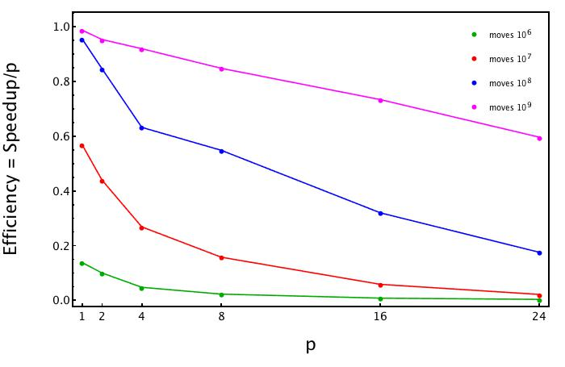

# Report: weak and strong scalability

We have seen the weak and strong scalability. 

- Weak scalability: measures how the speedup varies with the number of processor for a fixed problem size per processor.
- Strong scalability: measures how the speedup varies with the number of processor for a fixed problem size.

We tested a simple mote-carlo code to compute pi, both in a serial manner and a parallel one. The task was to establish when is worthwhile to parallelize a code. I wrote two bash script to implement the weak and strong approach and extract the elapse time of the execution. These are:

- pi_scrip_w.sh
- pi_scrip_s.sh

In the first figure we can see weak and strong scalability.

In the following plot it is shown the speedup. We can appreciate that if our code has few moves (10^6 − 10^7 ) then is not convenient to parallelize it. Otherwise, if the code has a great number of moves (say ≥ 10^8) then it is worthwhile to parallelize it.

In this third plot the efficiency (speedup/processors) is represented against the number of processors. The different lines are related to different number of moves in our computation. 

Every details about the code can be found in the folder code/.