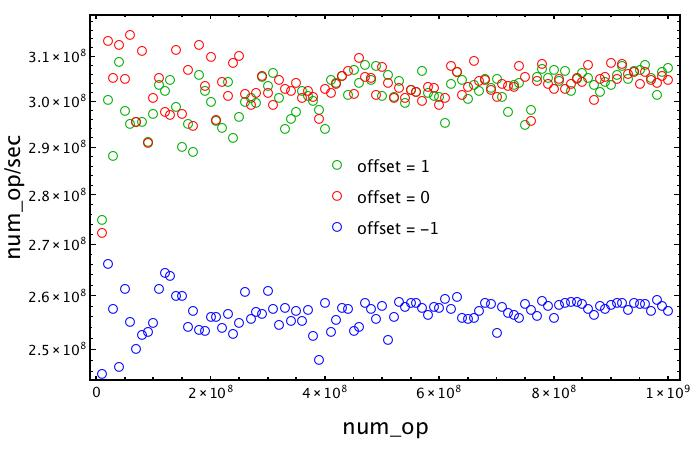
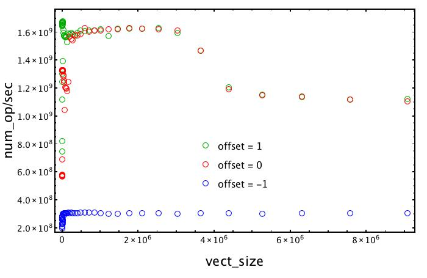
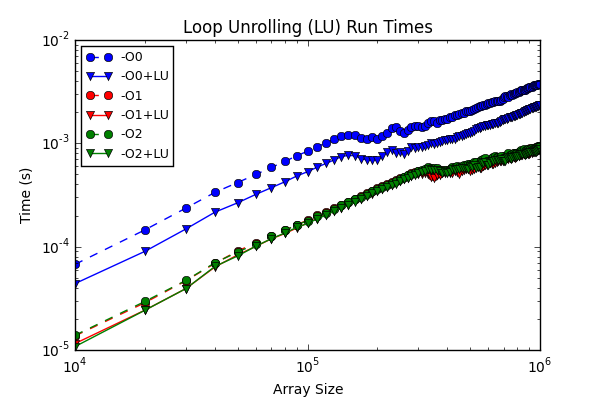

# Report: Pipeline and Offsets

Every details about the code can be found in the folder code_ex1/.

- ex01.c
- script_offset.sh

The program allocates a vector of 100K elements and performs the operation

```
A[i] = s*A[i + offset],
```

Here a piece of code
```c
for( count = 0; count < LOOP_SIZE; count++ ){
    for( i = 0; i < VECTOR_SIZE; i++){
        vector[i] = scalar * vector[i + OFFSET];
    }
}
```

where the offset can be `+1`, `0`, `-1`. The idea is to compute the number of operations per second that the processor is able to perform in each of the three cases.In the first two cases, when the `offset = +1, 0`, the pipeline is working well. The reading of the array is from left to right, so in this case the operation on the current element `A[n]` does not need to wait for the operation on itself or the next element `A[n+1]` to finish. Instead, when the offset is `−1` the pipeline is not anymore performed since the operation on `A[n]` needs to wait for the operation on `A[n-1]` to finish before it can read the value. In this last case the number of operations per second drop about 20%. This can be clearly seen in the following figure.






# Report: Vector Unrolling and Optimizations 

Every details about the code can be found in the folder code_ex2/.

- vect_unroll.c
- vect_unroll_script.sh

The idea is to develop a program that performs vector addition, unrolling eight entries per for loop. Compute the wall time for non optimized vector addition and compare it with the implemented vector unrolling version. Compare timing for the two different implementation.

If we want ot naively (not unrolled) implement vector addiction we can use the following code

```c
void vector_add(float *a, float *b, float *c, int dim)
    {
        int i;

        for (i = 0; i < dim; ++i) {
        c[i] = a[i] + b[i];
        }
    }
```

While if we implement unrolled loops (with eight entries) the addiction is given by

```c
void vector_add_unroll8(const float * a, const float *  b,
float * c, int dim)
    {
        int i,rest;

        rest = dim % 8; // entries that exceed dim % 8.

        // if the some rest is present
        for (i = 0; i < rest; i++) {
            c[i] = a[i] + b[i];
            }

        for ( i = rest; i < dim; i+=8) {

            c[i] = a[i] + b[i];
            c[i+1] = a[i+1] + b[i+1];
            c[i+2] = a[i+2] + b[i+2];
            c[i+3] = a[i+3] + b[i+3];
            c[i+4] = a[i+4] + b[i+4];
            c[i+5] = a[i+5] + b[i+5];
            c[i+6] = a[i+6] + b[i+6];
            c[i+7] = a[i+7] + b[i+7];
        }

}
```
We compiled the code containing both the versions of the vector addiction. In particular we also tried to compile the code with -O0, -O1 and -O2 optimization flags. For each case we compute the run time and plot it in the following figure.



We can apreciate that the slowest case is the one with no loop unrolling and non-optimized -O0 flag, as expected. 
The version with the same -O0 flag optimization but with loop unrolling algorithm gives a speedup of 1.5-2.
Then implementations with loop unrolling and with optimization flags -O1 and -O2 are the fastest. In general, this behavior is due to the fact that loop unrolling allows the pipeline to handle multiple distinct instructions involved in element-wise addition at the same time. Also, the flags -O1 and -O2 improve this further by adding further optimizations to the loop.