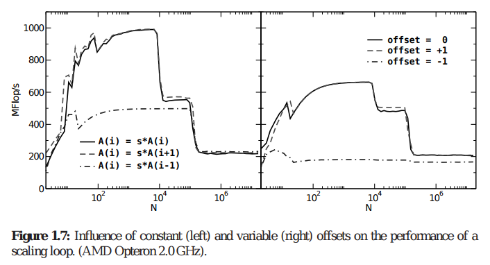

# Exercise 1, pipeline and offset

Develop a program that allocates a vector of 100K elements and perform
the following operation:

```
A(i)	=	s	*	A(i	+	offset)	
```

Compute the number of operations per second that the processor is able
to perform in each of the three cases. Use the provided `seconds()`
function to measure the time spent in a given code section.

Test the code giving the following offsets (-1, 0, 1) both as
variables read from command line (i.e, ./a.out -1 0 1) and as
constants known at compile time. Compile the code using -O2 level of
optimization and analyze the result obtained.



# Exercise 2, vector unrolling.

Develop a program that performs vector addition, unrolling eight
entries per for loop. Compute the wall time for non optimized vector
addition and compare it with the implemented vector unrolling
version. Compare timing for the two different implementation.

# Exercise 3, matrix-matrix multiplication

Write a 3-for loops for computing matrix-matrix multiplication.

# Write a report and push it to the master on your fork
