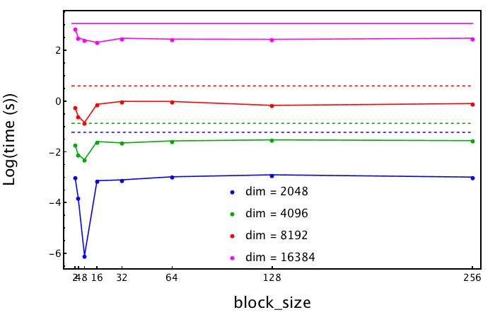

# Report of Day 3: Fast Transpose

We develop two functions to compute the transpose of a square matrix. Everything can be found in the folder: code/main.c. The fist function is the naive computation and is pretty slow. The second function is cache friendly and performs really better. We checked the performance for four different matrix size (2048,4096,8192,16384) and in the case of the fast function we tried different block sizes. ATTENTION: on the y-axes we have Log(time).

