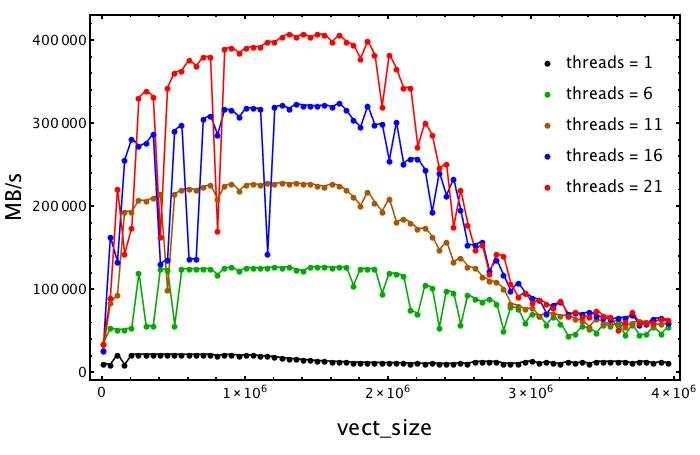
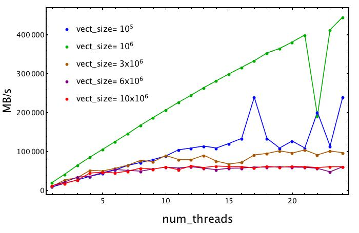

# Report of Day 4: Stream Benchmark

The analysis that follows was done using the c3e cluster. The stream benchmark checks the memory bandwidth while performing four elementary operations (Copy, Scale, Add, Triad).
In the following plot we estimate the overall bandwidth of a node, testing it with an increasing vector (array) size for a different number of swich-on threads, from 1 to 21. This operation was done using the ```OMP_NUM_THREADS``` environment variable. 
For each series (representad by different colors) we can see that when the size of the vector exceeds the L3 cache capability, then it begins to be stored in the RAM memory. Indeed, the triad (MB/s) considerably drops. The L3 cache capability is around `30MB`. This could be reached considering a vector of double with size `2*10^6`. In the stream code, we have three vectors


When we have a lots of threads available, the bandwidth is high and decreases if we decrease the number of threads.




In the second figure, the vector (array) size is kept fixed and we tested the bandwithd against the number of threads. The general behaviour is that, for each fixed vector size, the bandwidth increases as the number of threads increases. The best vector size seems to be 10^6 (green dots). The blue dots, which corresponds to a smaller vector size (10^5), have a worse bandwith. This could be related to the fact the the vector is too small in size and an increase of threads could only mess up the process, in particular the parallelization overhead is relatively heavy. If now we take the red dots we can observe that, since the size of our vector is huge (beyond the L3 cache capability), the increasing of the threads do not visibly benefits the bandwitdh.



We can also improve our analysis using the command `numactl` and exploiting the topology of the hardware. Using `numactl --hardware`, we can find:

```
available: 2 nodes (0-1)
node 0 cpus: 0 1 2 3 4 5 6 7 8 9 10 11
node 0 size: 32726 MB
node 0 free: 22526 MB
node 1 cpus: 12 13 14 15 16 17 18 19 20 21 22 23
node 1 size: 32768 MB
node 1 free: 24163 MB
node distances:
node   0   1 
0:  10  21 
1:  21  10 

```
just tested a single cpu and change the socket from which DRAM is used. To run the test I first set the threads to 12 and compiled with a vector size of N=10^7. In this way, the cpu and the memory used are on the same socket of the node, the result bendwidth is roughly 3.2 GB/s. The command is:

```
numactl --cpunodebind=0 --membind=0 ./stream
```

in this way the cpu and the memory used are on the same socket of the node, the result is roughly 3.3 GB/s.

One can now force the ccpu to use the memory on the other socket (each node has two sockets) and the result is a drop of velocity to 2.1 GB/s
The command used was:
```
numactl --cpunodebind=0 --membind=1 ./stream
```


# Report of Day 4: PingPong Benchmark

The idea is to measure the latency (for small bites) and the bandwitdh (for large bites) between cpus that exchange data. We have to Ccompare the results we obtain while running the tests for cores in the same socket, and for cores on different sockets.

The following benchmark was done between two processors on the same socket of an Ulysses's node. 
The command used was `mpirun -np 2 ./IMB-MPI1 PingPong`


```
#---------------------------------------------------
# Benchmarking PingPong 
# #processes = 2 
#---------------------------------------------------
#bytes #repetitions      t[usec]   Mbytes/sec
0         1000         0.45         0.00
1         1000         0.51         1.87
2         1000         0.51         3.76
4         1000         0.53         7.24
8         1000         0.52        14.67
16        1000         0.58        26.28
32        1000         0.59        51.55
64        1000         0.63        97.49
128       1000         0.32       382.66
256       1000         0.38       634.84
512       1000         0.47      1029.15
1024      1000         0.63      1548.88
2048      1000         0.90      2168.92
4096      1000         1.62      2406.05
8192      1000         2.53      3086.23
16384     1000         4.33      3611.89
32768     1000         7.19      4345.67
65536      640        11.54      5418.21
131072     320        21.99      5684.69
262144     160        39.97      6254.90
524288      80        75.94      6583.82
104857      40       143.70      6958.90
2097152     20       280.23      7137.11
4194304     10       549.79      7275.46
```


The following benchmark was done between two processors on different sockets on the master node. The command used was mpirun `--map-by socket -np 2 ./IMB-MPI1 PingPong`

```
List of Benchmarks to run:

PingPong

---------------------------------------------------
Benchmarking PingPong 
processes = 2 
---------------------------------------------------
bytes #repetitions      t[usec]   Mbytes/sec
0         1000         0.69         0.00
1         1000         0.71         1.35
2         1000         0.70         2.71
4         1000         0.71         5.40
8         1000         0.69        10.98
16        1000         0.73        20.86
32        1000         0.73        42.09
64        1000         1.15        53.17
128       1000         1.18       103.49
256       1000         1.20       204.13
512       1000         1.32       371.01
1024      1000         1.48       658.10
2048      1000         1.85      1056.35
4096      1000         2.44      1598.59
8192      1000         4.27      1831.13
16384     1000         7.24      2158.17
32768     1000        11.66      2679.31
65536      640        20.58      3036.38
131072     320        37.52      3331.26
262144     160        72.21      3462.00
524288      80       141.99      3521.44
1048576     40       312.25      3202.55
2097152     20       579.08      3453.77
4194304     10      1068.35      3744.08


All processes entering MPI_Finalize
```

We can clearly see that, with respect to the previous case, the velocity is considerably decreased.


